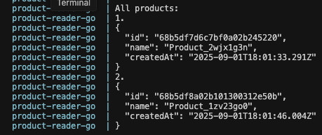

# Solution Walkthrough

This doc is where I documented my thinking process and solutions for each task in the assignment.

Before we start, lets understand what is the folder layout of this project, and what is the porpouse of each part:

```
devops-task-Sh4peSh1fter/
  - app-go/               # Go application with Dockerfile and docker-compose
    - docker-compose.yml  # Compose file for the Go app
    - Dockerfile         # Go app container definition
    - go.mod, go.sum    # Go dependencies
    - read_products.go  # Go application code
  
  - app-node/            # Node.js application
    - create_product.js  # Node.js application code
    - package files     # Node.js dependencies
  
  - mongo/              # MongoDB cluster setup
    - docker-compose.yml # Compose file for MongoDB and HAProxy
    - haproxy.cfg       # HAProxy load balancer configuration
    - mongo-keyfile     # Authentication keyfile for MongoDB replication
  
  - scripts/            # Python scripts for MongoDB management
    - check_replicaset_status.py  # Check MongoDB replica set health
    - create_app_user.py          # Create application user in MongoDB
    - init_mongo_servers.py       # Initialize MongoDB replica set
    - mongo_servers.yml           # MongoDB servers configuration
    - requirements.txt            # Python dependencies
```

## 1. Launch MongoDB servers using Docker Compose.

First we navigate to the mongo folder and run docker compose up. we can see at least two problems:
```bash
mongo-1     | {"t":{"$date":"2025-09-01T11:41:43.244+00:00"},"s":"E",  "c":"CONTROL",  "id":20568,   "ctx":"initandlisten","msg":"Error setting up listener","attr":{"error":{"code":9001,"codeName":"SocketException","errmsg":"setup bind :: caused by :: Address already in use"}}}
```

There is a bind error on the ports, plus the containers are exiting with error code 48.
We did define different ports in the compose file so its wierd they conflict.
When I search for port in the terminal logs I see that it uses "27017":
```bash
mongo-1     | {"t":{"$date":"2025-09-01T11:41:45.031+00:00"},"s":"I",  "c":"CONTROL",  "id":4615611, "ctx":"initandlisten","msg":"MongoDB starting","attr":{"pid":1,"port":27017,"dbPath":"/data/db","architecture":"64-bit","host":"docker-desktop"}}
```

We can also look inside the containers what port mongodb is actually using and what errors does it have in its logs (using docker logs).
For some reason the environment variables are not used by mongodb.

we can also see that the mongo services are using the hosts network and not the docker ridge network ("network_mode: host"), so I'm not sure if the insentive here is to change it and use "ports:".

There are multiple other ways to solve this that come to mind:
1. running a "command" line using mongod and its flags to set the port number.
2. use a configuration file "mongod.conf".
3. use a entrypoint script.

I think the entrypoint script is flexiable and good enougth, and it does work, but in the future the fact that the containers use the host's network and not a bridge is causeing some unexpected errors that are harder to fix. so I removed the host network mode and defined a docker bridge (although I do understand why sometimes we do want to use the host's network to remove complicated network layers like the bridge that are not needed and can cause problems in a production environment).

After fixing this and running the containers, I see (docker ps) that two of them are unhealthy. Specificakky, the primary mongo is healthy and the other two are not. from the logs I think that the error is cause because the mongo services are created and initiate using the keyfile and the username and password we give it, but without it creating the replicaset, it cant authenticate successfully, casuing it to throw an error, and the healthcheck that we defined in the docker compose is failing. 

We can see in the logs of mongo-0 (unhealthy):
```
"Checking authorization failed","error":"UserNotFound: Could not find user 'mongo-0' for db 'admin'"
```

Looking at mongo-2 (healthy):
```
"options":{"net":{"bindIp":"*","port":27032},"security":{"authorization":"enabled"}}
```

The issue is a chicken-and-egg problem:
1. MongoDB starts with authentication enabled (due to the mongo-keyfile)
2. The health check tries to authenticate with users that don't exist yet
3. The initialization script that would create these users can't run because it can't connect without authentication

the python scripts are trying to connect with authentication before using the localhost exception.

We can navigate to mongodb and manually authenticate, but we dont want manual actions to be part of the solution.
I have changed the healthcheck for now.

# 2. Utilize Python scripts

I'm guessing that the order of running the scripts is first init_mongo_servers, then check_replicaset_status, and finally create_app_user.

I gave all the scripts the right permissions (execute) and started with the init script:
```
python3 scripts/init_mongo_servers.py
```

Oops forgot to install the requirements. I'm using poetry so I created a venv and installed the requirements there using it.
```bash
python3 -m venv .venv

source .venv/bin/activate

pip install poetry

poetry init
```

When I run the script, I get this error:
```bash
Error connecting to MongoDB: 127.0.0.1:27034: [Errno 61] Connection refused (configured timeouts: socketTimeoutMS: 20000.0ms, connectTimeoutMS: 20000.0ms), Timeout: 30s, Topology Description: <TopologyDescription id: 68b590b9ec349f352f2834b4, topology_type: ReplicaSetNoPrimary, servers: [<ServerDescription ('127.0.0.1', 27034) server_type: Unknown, rtt: None, error=AutoReconnect('127.0.0.1:27034: [Errno 61] Connection refused (configured timeouts: socketTimeoutMS: 20000.0ms, connectTimeoutMS: 20000.0ms)')>]>
```

To understand why we get a timeout lets think what exactly is our architecture. there are 3 mongodb services that run behind an haproxy. 
looking at the configuration of the haproxy we can see that there is something wierd - we configure connection to mongo3, which is a service that doesn't exist because we have mongo0 - mongo2. also all 3 of them are configured as backup which is bad?

I changed the haproxy config so mongo0 is the primary, and used the services names instead of localhost.

Let's modify our docker-compose.yml to use both:
```yaml
command: ["mongod", "--port", "27030", "--bind_ip_all", "--replSet", "rs0", "--keyFile", "/etc/mongo-keyfile"]
```

This configuration:
1. Uses MongoDB's default entrypoint for initialization
2. Specifies the port for each node
3. Binds to all interfaces for network access
4. Enables replication with `--replSet rs0`
5. Configures authentication with `--keyFile`

After restarting, we get a new error:
```
Read security file failed: permissions on /etc/mongo-keyfile are too open
```

The issue is that MongoDB requires strict permissions on the keyfile.
Check the current permissions:
```bash
$ ls -l mongo-keyfile
-rw-r--r--@ 1 seansosis  staff  1024 Sep  1 14:26 mongo-keyfile
```

Fix the permissions:
```bash
$ chmod 400 mongo-keyfile
```
This fixed the issue.

The script runs and successfully initiates the mongodb services.
We need to change all the places where the local host is used, and use the services names instead.
The check_replicaset_status script ran without issues and the create_app_user created a user.

## 3. Execute the Node.js application to create two product entries

After running `npm install` and running the create_product script twice, we created 2 products in our db. This script also got tweaked, and I used direct connect to the primary instance (mongo0 in our case). 

## 4. Run the Go application container to retrieve and display all product entries

Finally I ran the docker compose of the go app, after tweaking it as well. It showed all the products that we have created.

