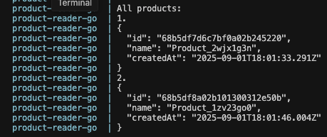

# DevOps Assignment

Hello and welcome to the Lumana home assignment!

## Goal
Your task is to set up and troubleshoot a production-ready MongoDB replica set using Docker Compose, along with its supporting applications. The setup includes a MongoDB cluster with HAProxy for load balancing, and sample applications in Node.js and Go to demonstrate the cluster's functionality.

## Project Structure
```
.
├── app-go/                 # Go application for reading products
│   ├── docker-compose.yml  # Docker setup for Go app
│   ├── Dockerfile         # Go app container definition
│   └── read_products.go   # Product reader implementation
├── app-node/              # Node.js application for creating products
│   ├── create_product.js  # Product creator implementation
│   └── package.json      # Node.js dependencies
├── mongo/                 # MongoDB cluster setup
│   ├── docker-compose.yml # Main cluster configuration
│   ├── haproxy.cfg       # HAProxy load balancer config
│   └── mongo-keyfile     # MongoDB authentication keyfile
└── scripts/              # Python management scripts
    ├── init_mongo_servers.py      # Initialize replica set
    ├── check_replicaset_status.py # Check cluster health
    └── create_app_user.py         # Create application user
```

## Assignment Steps

1. MongoDB Cluster Setup
   - Launch a 3-node MongoDB replica set using Docker Compose
   - Ensure all containers are healthy and properly configured
   - Verify HAProxy is correctly load balancing between nodes

2. Cluster Management
   - Run Python scripts to initialize and verify the replica set
   - Create necessary users for application access

3. Application Testing
   - Run Node.js app to create sample products
   - Deploy Go container to read and verify the products

## Success Criteria
- All containers running and healthy
- Replica set properly initialized and authenticated
- Products can be created through Node.js app
- Products can be read through Go app
- Best DevOps practices applied throughout

the Go application output should look like this:


Good luck and feel free to ask questions via Gmail at @your_gmail